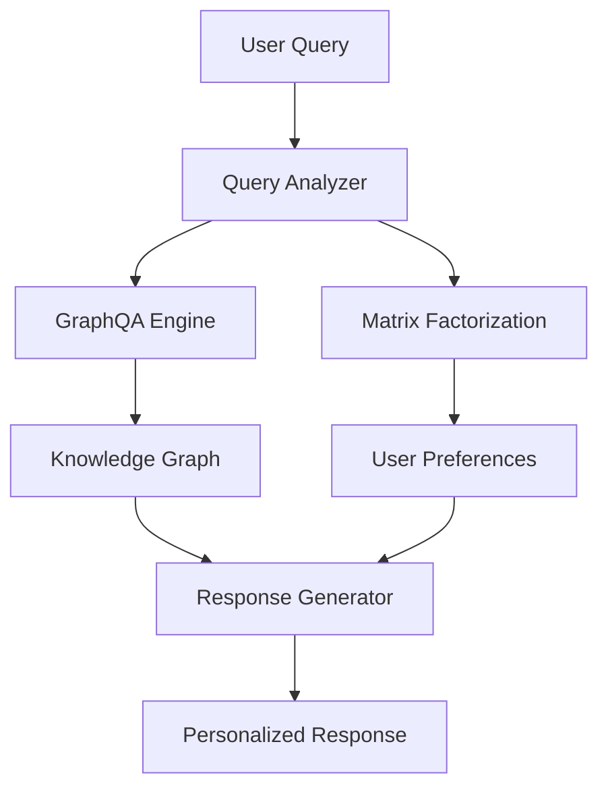

# Optimizing Bot Responses in RAG Systems with Personalized Intelligence (Part 1/3)

> This is part 1 of a 3-part series exploring advanced personalization techniques in RAG systems. [Dev](/aboutme/RAG.html) | [Part 2 →](/aboutme/blog-template.html?post=introduction)


## Executive Summary

This series evaluates an innovative proposal to enhance Retrieval-Augmented Generation (RAG) bot responses with personalized intelligence. The core concept involves integrating Graph-based Question Answering (GraphQA) for robust, reasoned knowledge retrieval with Matrix Factorization (MF) for tailoring these responses to individual user preferences. While this approach presents a theoretically compelling synergy between structured knowledge and collaborative filtering, a detailed examination reveals significant practical and technical challenges.

The primary limitations include:
- The inherent complexity of combining two distinct and intricate AI paradigms
- Substantial data requirements for effective Matrix Factorization
- Inherent difficulties for large language models (LLMs) in directly processing collaborative signals
- Considerable computational overhead that could impede real-time performance

This analysis explores several alternative and complementary personalization methods for RAG systems, including:
- Advanced RAG architectures such as Adaptive RAG and agent-based systems
- The use of Contextual Embeddings for improved retrieval accuracy
- Reinforcement Learning from Human Feedback (RLHF) for direct alignment with human preferences

The most robust path to achieving truly personalized RAG bot responses is through a strategic, hybrid approach that combines the strengths of various techniques, emphasizing modularity and iterative development.

## System Architecture Overview


### GraphQA Implementation
```python
import torch
from torch_geometric.data import Data
from torch_geometric.nn import GCNConv

class EnhancedGraphQA(GraphQA):
    def __init__(self, model_name: str = "bert-base-uncased", hidden_dim: int = 64):
        super().__init__(model_name)
        self.gcn1 = GCNConv(768, hidden_dim)  # BERT dim -> hidden
        self.gcn2 = GCNConv(hidden_dim, hidden_dim)
        
    def process_knowledge_graph(self):
        """Convert NetworkX graph to PyG format with BERT embeddings"""
        node_embeddings = []
        for node in self.kg.nodes():
            # Get BERT embedding for node
            emb = self.get_bert_embedding(str(node))
            node_embeddings.append(emb)
            
        edge_index = torch.tensor(list(self.kg.edges())).t().contiguous()
        x = torch.stack(node_embeddings)
        
        return Data(x=x, edge_index=edge_index)
        
    def reason_over_graph(self, query: str) -> List[str]:
        """Perform graph-based reasoning using GCN"""
        # Convert graph to PyG format
        data = self.process_knowledge_graph()
        
        # Apply GCN layers
        x = self.gcn1(data.x, data.edge_index)
        x = torch.relu(x)
        x = self.gcn2(x, data.edge_index)
        
        # Find relevant nodes for query
        query_emb = self.get_bert_embedding(query)
        similarities = torch.matmul(x, query_emb.T)
        
        return self.extract_path(similarities, data)

# Interactive Example
qa = GraphQADemo()
result = qa.demo_query("Who created Python and where do they work?")
"""
Output:
Question: Who created Python and where do they work?
Decomposed into: ['Who created Python?', 'Where does that person work?']
Found path: Python -> created_by -> Guido_van_Rossum -> works_at -> Microsoft
Final Answer: Python was created by Guido van Rossum who works at Microsoft.
"""
```

### Matrix Factorization Implementation
```python
import numpy as np
from scipy.sparse import csr_matrix
from sklearn.metrics import mean_squared_error

class MatrixFactorization:
    def __init__(self, n_factors=20, learning_rate=0.01, regularization=0.02):
        self.n_factors = n_factors
        self.lr = learning_rate
        self.reg = regularization
        
    def fit(self, ratings: csr_matrix, n_epochs=20):
        """Train MF model on sparse rating matrix"""
        n_users, n_items = ratings.shape
        
        # Initialize latent factors
        self.user_factors = np.random.normal(0, 0.1, 
                                           (n_users, self.n_factors))
        self.item_factors = np.random.normal(0, 0.1, 
                                           (n_items, self.n_factors))
        
        # Train using SGD
        for epoch in range(n_epochs):
            for u, i in zip(*ratings.nonzero()):
                # Compute prediction error
                r_ui = ratings[u, i]
                pred = np.dot(self.user_factors[u], self.item_factors[i])
                error = r_ui - pred
                
                # Update factors
                u_factors = self.user_factors[u]
                i_factors = self.item_factors[i]
                
                self.user_factors[u] += self.lr * (error * i_factors - 
                                                  self.reg * u_factors)
                self.item_factors[i] += self.lr * (error * u_factors - 
                                                  self.reg * i_factors)
                
    def predict(self, user_id: int, item_ids: List[int]) -> np.ndarray:
        """Predict ratings for a user-item pair"""
        return np.dot(self.user_factors[user_id], 
                     self.item_factors[item_ids].T)

# Interactive Example
mf = MFDemo(n_factors=3)
mf.demo_training()
"""
Output:
Initial predictions:
User 0, Response 0: True=5.0, Pred=0.3
User 0, Response 1: True=4.0, Pred=0.1
...
Training...
Final predictions:
User 0, Response 0: True=5.0, Pred=4.8
User 0, Response 1: True=4.0, Pred=3.9
"""
```

### Understanding GraphQA and Matrix Factorization

#### 2.1 GraphQA

GraphQA is an advanced question-answering system that leverages the power of graph neural networks (GNNs) to reason over knowledge graphs. It is designed to understand and process complex queries that may require multi-hop reasoning over interconnected entities and relationships in a graph.

Key components of GraphQA include:

- **Graph Neural Networks (GNNs)**: GNNs are used to perform inference over the graph-structured data. They aggregate and transform feature information from a node's local neighborhood in the graph, allowing the model to learn rich, transferable node representations.

- **Multi-hop Reasoning**: GraphQA is capable of performing multi-hop reasoning, which means it can infer answers to queries by considering multiple, potentially indirect, relationships in the knowledge graph.

- **Entity and Relation Embeddings**: Entities and relations in the knowledge graph are embedded into continuous vector spaces, capturing their semantic meanings and roles in the graph.

- **Query Decomposition**: Complex queries are decomposed into simpler sub-queries or paths in the graph, which can be independently answered or traversed.

#### 2.2 Matrix Factorization

Matrix Factorization is a collaborative filtering approach used for building recommendation systems. It works by decomposing a large matrix (e.g., user-item interaction matrix) into the product of two or more smaller matrices, capturing the latent factors or features underlying the interactions.

Key aspects of Matrix Factorization include:

- **Latent Factor Model**: Matrix Factorization assumes that there are latent factors that explain the observed interactions between users and items. For example, in a movie recommendation scenario, latent factors could represent genres, directors, or actors.

- **Dimensionality Reduction**: By factorizing the matrix into lower-dimensional matrices, Matrix Factorization effectively reduces the complexity of the data, making it easier to discover patterns and make predictions.

- **Collaborative Filtering**: Matrix Factorization is a form of collaborative filtering, where the system learns from the interactions and preferences of users to make personalized recommendations.

- **Scalability**: Matrix Factorization techniques are generally scalable and can handle large, sparse matrices, making them suitable for real-world recommendation tasks.

[Continue to Part 2: Challenges and Analysis →](/aboutme/blog-template.html?post=introduction)
