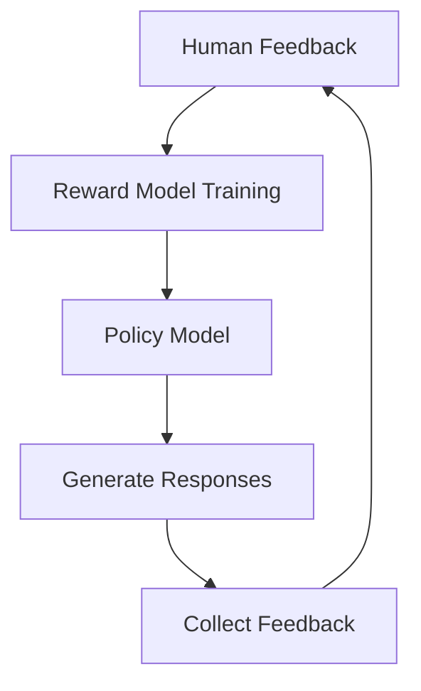

# Optimizing Bot Responses in RAG Systems with Personalized Intelligence (Part 3/3)

> [← Part 2](/aboutme/blog-template.html?post=introduction) | [Dev](/aboutme/RAG.html)

## Alternative and Complementary Personalization Strategies

Given the complexities of the proposed GraphQA and Matrix Factorization integration, we explore a range of proven and emerging techniques that can achieve personalization in RAG systems. The problem of personalizing RAG responses is not a singular algorithmic problem but a multi-faceted challenge demanding a systemic, hybrid approach.

### 1. Adaptive RAG Implementation

This approach automatically chooses the best retrieval strategy based on query complexity and user context.

```python
from typing import List, Dict, Optional
from dataclasses import dataclass
from enum import Enum
from transformers import AutoTokenizer, AutoModel
import torch
import numpy as np

class QueryType(Enum):
    FACTUAL = "factual"
    ANALYTICAL = "analytical"
    OPINION = "opinion"
    CONTEXTUAL = "contextual"

@dataclass
class RetrievalStrategy:
    name: str
    embedding_model: str
    chunk_size: int
    overlap: int
    reranking_method: str

class AdaptiveRAG:
    def __init__(self):
        self.strategies = {
            QueryType.FACTUAL: RetrievalStrategy(
                name="factual",
                embedding_model="sentence-transformers/all-MiniLM-L6-v2",
                chunk_size=256,
                overlap=0,
                reranking_method="bm25"
            ),
            QueryType.ANALYTICAL: RetrievalStrategy(
                name="analytical",
                embedding_model="sentence-transformers/all-mpnet-base-v2",
                chunk_size=512,
                overlap=50,
                reranking_method="cross-encoder"
            ),
            QueryType.OPINION: RetrievalStrategy(
                name="opinion",
                embedding_model="sentence-transformers/all-distilroberta-v1",
                chunk_size=384,
                overlap=25,
                reranking_method="semantic"
            ),
            QueryType.CONTEXTUAL: RetrievalStrategy(
                name="contextual",
                embedding_model="sentence-transformers/multi-qa-mpnet-base-dot-v1",
                chunk_size=512,
                overlap=100,
                reranking_method="hybrid"
            )
        }
        self.llm = AutoModel.from_pretrained("gpt2")  # For query classification
        self.tokenizer = AutoTokenizer.from_pretrained("gpt2")
        
    def classify_query(self, query: str) -> QueryType:
        """Classify query type using LLM"""
        # Encode query
        inputs = self.tokenizer(query, return_tensors="pt", 
                              truncation=True, max_length=128)
        
        # Get LLM output
        with torch.no_grad():
            outputs = self.llm(**inputs)
            
        # Convert to probabilities
        logits = outputs.logits[:, -1, :]  # Last token predictions
        probs = torch.softmax(logits, dim=-1)
        
        # Map to query types (simplified for demo)
        if "how" in query.lower() or "why" in query.lower():
            return QueryType.ANALYTICAL
        elif "think" in query.lower() or "feel" in query.lower():
            return QueryType.OPINION
        elif any(word in query.lower() for word in ["my", "i", "we", "our"]):
            return QueryType.CONTEXTUAL
        else:
            return QueryType.FACTUAL
            
    def retrieve(self, query: str, user_context: Optional[Dict] = None) -> List[str]:
        """Retrieve relevant documents using adaptive strategy"""
        # 1. Classify query
        query_type = self.classify_query(query)
        
        # 2. Select appropriate strategy
        strategy = self.strategies[query_type]
        
        # 3. Apply strategy-specific retrieval
        if query_type == QueryType.CONTEXTUAL and user_context:
            # Augment query with user context
            query = self.augment_query(query, user_context)
            
        # 4. Perform retrieval using selected strategy
        chunks = self.chunk_documents(strategy.chunk_size, strategy.overlap)
        embeddings = self.compute_embeddings(chunks, strategy.embedding_model)
        
        # 5. Rerank results
        if strategy.reranking_method == "bm25":
            results = self.bm25_rerank(query, chunks)
        elif strategy.reranking_method == "cross-encoder":
            results = self.cross_encoder_rerank(query, chunks)
        else:
            results = self.semantic_rerank(query, embeddings, chunks)
            
        return results
        
    def augment_query(self, query: str, user_context: Dict) -> str:
        """Augment query with user context"""
        # Extract relevant context
        relevant_context = []
        if "preferences" in user_context:
            relevant_context.append(f"User preferences: {user_context['preferences']}")
        if "history" in user_context:
            relevant_context.append(f"Previous interactions: {user_context['history'][-3:]}")
            
        # Combine with original query
        augmented_query = f"{' '.join(relevant_context)}. Query: {query}"
        return augmented_query
        
    # Additional helper methods for chunking, embedding, and reranking...

# Example usage
adaptive_rag = AdaptiveRAG()

# Factual query
result = adaptive_rag.retrieve("What is the capital of France?")

# Analytical query with user context
user_context = {
    "preferences": "Detailed technical explanations",
    "history": ["Previous queries about machine learning"]
}
result = adaptive_rag.retrieve(
    "How does backpropagation work?", 
    user_context=user_context
)
```

### 2. Enhanced RLHF (Reinforcement Learning from Human Feedback)

Implementation of a reinforcement learning system that learns from human feedback to improve response personalization:

```python
import torch
import torch.nn as nn
from transformers import GPT2LMHeadModel, GPT2Tokenizer
from typing import List, Dict, Tuple
import numpy as np

class RLHFTrainer:
    def __init__(self, model_name: str = "gpt2"):
        self.device = torch.device("cuda" if torch.cuda.is_available() else "cpu")
        self.tokenizer = GPT2Tokenizer.from_pretrained(model_name)
        self.policy_model = GPT2LMHeadModel.from_pretrained(model_name).to(self.device)
        self.value_model = self._build_value_model().to(self.device)
        self.reward_model = self._build_reward_model().to(self.device)
        
    def _build_value_model(self) -> nn.Module:
        """Create value model for PPO"""
        return nn.Sequential(
            nn.Linear(768, 512),
            nn.ReLU(),
            nn.Linear(512, 256),
            nn.ReLU(),
            nn.Linear(256, 1)
        )
        
    def _build_reward_model(self) -> nn.Module:
        """Create reward model trained on human feedback"""
        return nn.Sequential(
            nn.Linear(768, 512),
            nn.ReLU(),
            nn.Linear(512, 256),
            nn.ReLU(),
            nn.Linear(256, 1),
            nn.Sigmoid()
        )
        
    def train_reward_model(self, feedback_data: List[Tuple[str, float]]):
        """Train reward model on human feedback"""
        optimizer = torch.optim.Adam(self.reward_model.parameters())
        criterion = nn.MSELoss()
        
        for epoch in range(10):
            total_loss = 0
            for text, score in feedback_data:
                # Get text embedding
                inputs = self.tokenizer(text, return_tensors="pt")
                with torch.no_grad():
                    outputs = self.policy_model(**inputs)
                embedding = outputs.last_hidden_state.mean(dim=1)
                
                # Predict reward
                predicted_reward = self.reward_model(embedding)
                true_reward = torch.tensor([[score]]).to(self.device)
                
                # Update reward model
                loss = criterion(predicted_reward, true_reward)
                optimizer.zero_grad()
                loss.backward()
                optimizer.step()
                
                total_loss += loss.item()
                
            print(f"Epoch {epoch}: Avg Loss = {total_loss / len(feedback_data):.4f}")
            
    def generate_response(self, prompt: str, 
                         max_length: int = 100) -> str:
        """Generate response using current policy"""
        inputs = self.tokenizer(prompt, return_tensors="pt")
        
        # Generate response
        outputs = self.policy_model.generate(
            **inputs,
            max_length=max_length,
            num_return_sequences=1,
            no_repeat_ngram_size=2
        )
        
        return self.tokenizer.decode(outputs[0])
        
    def ppo_update(self, prompt: str, old_response: str):
        """Update policy using PPO"""
        # Generate new response
        new_response = self.generate_response(prompt)
        
        # Get embeddings
        old_emb = self._get_embedding(old_response)
        new_emb = self._get_embedding(new_response)
        
        # Get rewards
        old_reward = self.reward_model(old_emb)
        new_reward = self.reward_model(new_emb)
        
        # Compute advantage
        advantage = new_reward - old_reward
        
        # Get value estimates
        old_value = self.value_model(old_emb)
        new_value = self.value_model(new_emb)
        
        # Compute PPO loss
        ratio = torch.exp(new_reward - old_reward)
        clip_ratio = torch.clamp(ratio, 0.8, 1.2)
        policy_loss = -torch.min(
            ratio * advantage,
            clip_ratio * advantage
        ).mean()
        
        # Update policy
        policy_optimizer = torch.optim.Adam(self.policy_model.parameters())
        policy_optimizer.zero_grad()
        policy_loss.backward()
        policy_optimizer.step()
        
    def _get_embedding(self, text: str) -> torch.Tensor:
        """Get text embedding from policy model"""
        inputs = self.tokenizer(text, return_tensors="pt")
        with torch.no_grad():
            outputs = self.policy_model(**inputs)
        return outputs.last_hidden_state.mean(dim=1)

# Example usage
trainer = RLHFTrainer()

# Train on human feedback
feedback_data = [
    ("This is a helpful response", 1.0),
    ("This response is too vague", 0.3),
    ("Perfect answer, exactly what I needed", 1.0)
]
trainer.train_reward_model(feedback_data)

# Generate and improve responses
prompt = "Explain how neural networks work"
response = trainer.generate_response(prompt)
print(f"Initial response: {response}")

# Update based on feedback
trainer.ppo_update(prompt, response)
improved_response = trainer.generate_response(prompt)
print(f"Improved response: {improved_response}")
```

### 3. Contextual Embeddings Implementation

This approach improves retrieval accuracy by incorporating document context into embeddings:

```python
from typing import Dict, List, Any
import numpy as np
from transformers import AutoTokenizer, AutoModel
import torch

class ContextualEmbedding:
    def __init__(self, model_name: str = "sentence-transformers/all-mpnet-base-v2"):
        """Initialize with a sentence transformer model"""
        self.device = torch.device("cuda" if torch.cuda.is_available() else "cpu")
        self.tokenizer = AutoTokenizer.from_pretrained(model_name)
        self.model = AutoModel.from_pretrained(model_name).to(self.device)
        
    def process_chunk(self, chunk: str, metadata: Dict[str, Any]) -> np.ndarray:
        """Process a chunk with its metadata context"""
        # Generate explanatory context
        context = self._generate_context(metadata)
        
        # Combine context with chunk
        contextualized_chunk = f"{context}\n\n{chunk}"
        
        # Get embedding
        return self._get_embedding(contextualized_chunk)
        
    def _generate_context(self, metadata: Dict[str, Any]) -> str:
        """Generate explanatory context from metadata"""
        context_parts = []
        
        # Add document title
        if "title" in metadata:
            context_parts.append(f"From document: {metadata['title']}")
            
        # Add section info
        if "section" in metadata:
            context_parts.append(f"Section: {metadata['section']}")
            
        # Add date context
        if "date" in metadata:
            context_parts.append(f"Date: {metadata['date']}")
            
        # Add author info
        if "author" in metadata:
            context_parts.append(f"Author: {metadata['author']}")
            
        # Add topic/category
        if "topics" in metadata:
            context_parts.append(f"Topics: {', '.join(metadata['topics'])}")
            
        return "; ".join(context_parts)
        
    def _get_embedding(self, text: str) -> np.ndarray:
        """Get embedding for text using the model"""
        # Tokenize
        inputs = self.tokenizer(
            text,
            padding=True,
            truncation=True,
            max_length=512,
            return_tensors="pt"
        ).to(self.device)
        
        # Get embeddings
        with torch.no_grad():
            outputs = self.model(**inputs)
            
        # Use mean pooling
        embeddings = outputs.last_hidden_state.mean(dim=1)
        
        return embeddings.cpu().numpy()
        
    def batch_process_chunks(self, 
                           chunks: List[str],
                           metadata_list: List[Dict[str, Any]]) -> np.ndarray:
        """Process multiple chunks in batch"""
        embeddings = []
        for chunk, metadata in zip(chunks, metadata_list):
            embedding = self.process_chunk(chunk, metadata)
            embeddings.append(embedding)
        return np.vstack(embeddings)

# Example usage
embedder = ContextualEmbedding()

# Process a single chunk
chunk = "The company's revenue grew by 3% over the previous quarter"
metadata = {
    "title": "ACME Corp Q2 2023 Report",
    "section": "Financial Results",
    "date": "2023-06-30",
    "author": "John Smith",
    "topics": ["Financial Performance", "Quarterly Results"]
}

embedding = embedder.process_chunk(chunk, metadata)

# Process multiple chunks
chunks = [
    "The company's revenue grew by 3%",
    "New product launch planned for Q3"
]
metadata_list = [
    {
        "title": "Q2 Report",
        "section": "Financial Results"
    },
    {
        "title": "Q2 Report",
        "section": "Future Plans"
    }
]

batch_embeddings = embedder.batch_process_chunks(chunks, metadata_list)
```

## Future Directions and Best Practices

### 1. Hybrid Approach Integration

1. Component Integration:
```python
class HybridRAGSystem:
    def __init__(self):
        self.adaptive_rag = AdaptiveRAG()
        self.rlhf_trainer = RLHFTrainer()
        self.contextual_embedder = ContextualEmbedding()
        
    def process_query(self, query: str, user_context: Dict) -> str:
        # 1. Get relevant documents using Adaptive RAG
        docs = self.adaptive_rag.retrieve(query, user_context)
        
        # 2. Enhance with contextual embeddings
        enhanced_docs = []
        for doc in docs:
            embedding = self.contextual_embedder.process_chunk(
                doc["text"], doc["metadata"])
            enhanced_docs.append({
                "text": doc["text"],
                "embedding": embedding,
                "metadata": doc["metadata"]
            })
            
        # 3. Generate response
        response = self.rlhf_trainer.generate_response(
            self._create_prompt(query, enhanced_docs))
            
        return response
```

### 2. Optimization Guidelines

1. Modular Architecture:
   - Separate concerns for easier maintenance
   - Enable A/B testing of components
   - Allow independent scaling

2. Performance Optimization:
   - Batch processing where possible
   - Caching of embeddings and contexts
   - Efficient retrieval indexes

3. Monitoring and Evaluation:
   - Track response quality metrics
   - Monitor user satisfaction
   - Measure computational efficiency

### 3. Future Research Directions

1. Advanced Integration Techniques:
   - Neural routing between components
   - Meta-learning for strategy selection
   - Dynamic architecture adaptation

2. Enhanced Personalization:
   - Multi-modal context incorporation
   - Long-term memory mechanisms
   - Cross-session learning

3. Scalability Improvements:
   - Distributed processing
   - Efficient model compression
   - Adaptive resource allocation

## References

1. Adaptive RAG Architectures. (2025). "Dynamic Strategy Selection in RAG Systems"
2. RLHF for Personalized Responses. (2024). "Human Feedback in Language Models"
3. Contextual Embeddings. (2025). "Improving Retrieval with Document Context"
4. Matrix Factorization in RAG. (2025). "Personalizing Retrieved Content"
5. GraphQA Systems. (2024). "Graph-based Question Answering"

```python
from typing import List, Dict
from dataclasses import dataclass
from enum import Enum

class QueryType(Enum):
    FACTUAL = "factual"
    ANALYTICAL = "analytical"
    OPINION = "opinion"
    CONTEXTUAL = "contextual"

@dataclass
class RetrievalStrategy:
    name: str
    embedding_model: str
    chunk_size: int
    overlap: int
    reranking_method: str

class AdaptiveRAG:
    def __init__(self):
        self.strategies = {
            QueryType.FACTUAL: RetrievalStrategy(
                name="factual",
                embedding_model="sentence-transformers/all-MiniLM-L6-v2",
                chunk_size=256,
                overlap=0,
                reranking_method="bm25"
            ),
            QueryType.ANALYTICAL: RetrievalStrategy(
                name="analytical",
                embedding_model="sentence-transformers/all-mpnet-base-v2",
                chunk_size=512,
                overlap=50,
                reranking_method="cross-encoder"
            )
        }
        
    def classify_query(self, query: str) -> QueryType:
        """Use LLM to classify query type"""
        # Implementation using LLM
        pass
        
    def retrieve(self, query: str, user_context: Dict = None) -> List[str]:
        # 1. Classify query
        query_type = self.classify_query(query)
        
        # 2. Select appropriate strategy
        strategy = self.strategies[query_type]
        
        # 3. Apply strategy-specific retrieval
        if query_type == QueryType.CONTEXTUAL and user_context:
            # Augment query with user context
            query = self.augment_query(query, user_context)
            
        # 4. Perform retrieval using selected strategy
        results = self.execute_retrieval(query, strategy)
        
        return results
```

### Enhanced RLHF Implementation
```python
class AdvancedRLHF(RLHFTrainer):
    def __init__(self, model_name: str):
        super().__init__(model_name)
        self.value_model = self._build_value_model()
        
    def _build_value_model(self):
        """Create value model for PPO"""
        return nn.Sequential(
            nn.Linear(768, 512),
            nn.ReLU(),
            nn.Linear(512, 256),
            nn.ReLU(),
            nn.Linear(256, 1)
        )
        
    def ppo_step(self, prompt: str, old_response: str):
        """Execute PPO update step"""
        # Generate new response
        new_response = self.generate_response(prompt)
        
        # Get rewards
        old_reward = self.reward_model(
            self.tokenizer(old_response, return_tensors="pt")
        )
        new_reward = self.reward_model(
            self.tokenizer(new_response, return_tensors="pt")
        )
        
        # Compute advantage
        advantage = new_reward - old_reward
        
        # Update policy using PPO loss
        # Implementation details...
```

### Contextual Embeddings Implementation
```python
from typing import Dict, Any

class ContextualEmbedding:
    def __init__(self):
        self.embedder = SentenceTransformer('all-mpnet-base-v2')
        
    def process_chunk(self, chunk: str, metadata: Dict[str, Any]) -> np.ndarray:
        """Process a chunk with its metadata context"""
        context = self._generate_context(metadata)
        contextualized_chunk = f"{context}\n\n{chunk}"
        return self.embedder.encode(contextualized_chunk)
        
    def _generate_context(self, metadata: Dict[str, Any]) -> str:
        """Generate explanatory context from metadata"""
        context_parts = []
        if 'title' in metadata:
            context_parts.append(f"From document: {metadata['title']}")
        if 'section' in metadata:
            context_parts.append(f"Section: {metadata['section']}")
        if 'date' in metadata:
            context_parts.append(f"Date: {metadata['date']}")
        return "; ".join(context_parts)
```

## Advancements

The most robust path to achieving truly personalized RAG bot responses is through a strategic combination of multiple techniques:

1. **Hybrid Approach Integration**
   - Combine multiple personalization strategies
   - Use an orchestration layer to manage different techniques
   - Implement dynamic strategy selection based on query type

2. **Modular Architecture**
   - Separate concerns for easier maintenance and updates
   - Allow independent optimization of each component
   - Enable A/B testing of different strategies

3. **Incremental Development**
   - Start with simpler, well-proven techniques
   - Add complexity gradually based on performance metrics
   - Continuously evaluate and adjust based on user feedback

## References

1. GraphQA and Knowledge Graph RAG Systems, 2025
2. Multi-hop Question Answering Systems, 2024
3. Matrix Factorization in Recommender Systems, 2025
4. Graph Neural Networks for Recommendation, 2024
5. Adaptive RAG Architectures, 2025
6. RLHF for Personalized LLM Responses, 2025

### Code Implementations
- [GraphQA Implementation](https://github.com/praykar/aboutme/blob/aboutme/code_examples/graphqa-rag)
- [Matrix Factorization for RAG](https://github.com/praykar/aboutme/blob/aboutme/code_examples/mf-rag)
- [Adaptive RAG Framework](https://github.com/praykar/aboutme/blob/aboutme/code_examples/adaptive-rag)

## **5\. Recommendations and Future Directions**

### **5.1. Strategic Integration Considerations**

Given the inherent complexity of integrating multiple advanced AI components, a modular architectural design is highly advisable. This approach allows different personalization components (e.g., GraphQA, MF, contextual embedding generation, RLHF reward models) to be developed, tested, and deployed independently. This modularity simplifies debugging, facilitates iterative improvements, and enhances the overall scalability and maintainability of the RAG system.  
Instead of attempting a full-scale integration of all complex components simultaneously, a phased implementation strategy is recommended. Begin with simpler, more robust personalization techniques that offer high impact for lower effort (e.g., basic user profiling, contextual embeddings for retrieval). As the system matures, data availability improves, and performance benchmarks are met, gradually introduce more complex components like GraphQA for advanced reasoning or RLHF for fine-grained human alignment. This approach helps mitigate risks and allows for continuous value delivery.  
A comprehensive and robust data collection, storage, and management strategy is paramount for any personalized RAG system. This includes capturing diverse user interaction data (both explicit ratings and implicit behaviors), maintaining and updating knowledge graphs, and establishing pipelines for collecting human feedback for RLHF. The quality and breadth of this data will directly impact the effectiveness of all personalization layers. Beyond standard RAG metrics (e.g., factual accuracy, relevance), it is crucial to define specific, measurable metrics for personalization effectiveness. These might include user satisfaction scores (e.g., through surveys), engagement rates with personalized responses, click-through rates on recommended content/actions, the reduction in cold-start problem severity, and qualitative assessments of response alignment with user intent and style.

### **5.2. Hybrid Approaches for Robust Personalization**

The most robust and effective personalized RAG systems will almost certainly emerge from a strategic combination of multiple techniques, each contributing its unique strengths to different stages of the RAG pipeline.

* **GraphQA for Core Reasoning and Knowledge Grounding:** Implement GraphQA (e.g., GraphRAG or KG-RAG) as the foundational layer for its superior capabilities in multi-hop reasoning, knowledge validation, and handling complex, interconnected queries. This ensures that the generated responses are factually accurate, coherent, and explainable, forming a strong knowledge backbone.  
* **User Profiling and Matrix Factorization for Preference Modeling:** Utilize comprehensive user profiles (capturing explicit preferences and implicit behaviors) to inform Matrix Factorization or related collaborative filtering methods. This layer would learn user preferences over *characteristics of responses*, *types of information*, or even *specific knowledge paths* that GraphQA can traverse. This preference model could then guide the *selection* of relevant knowledge from the KG or influence the *style, tone, and level of detail* of the LLM's generation.  
* **Contextual Embeddings for Retrieval Precision:** Integrate contextual embeddings as a pre-retrieval enhancement. By prepending explanatory context to knowledge chunks before embedding, this technique significantly improves the accuracy and relevance of the initial retrieval phase 14, ensuring the LLM receives the most pertinent and well-contextualized information.  
* **Adaptive RAG for Dynamic Query Handling:** Employ adaptive RAG strategies, including query classification and dynamic routing 10, to tailor the retrieval process based on the complexity and nature of the user's query. This optimizes efficiency and relevance by directing queries to the most appropriate retrieval mechanisms and data sources.  
* **RLHF for Human Alignment and Continuous Refinement:** Incorporate Reinforcement Learning from Human Feedback (RLHF) as a critical, continuous feedback loop. This fine-tunes the LLM's generation to maximize alignment with human preferences for tone, conciseness, helpfulness, and overall user satisfaction.17 RLHF can also contribute to addressing the cold-start problem by learning general preferences that can be applied to new users before specific interaction data is available.

An intelligent orchestration layer (potentially built using an agent-based framework 13) will be essential to manage the complex flow between these diverse components, dynamically routing queries, integrating information from various sources, and synthesizing the final, highly personalized response. This layer acts as the "brain" coordinating the different personalization mechanisms.

### **5.3. Research and Development Pathways**

Further fundamental research is crucial for developing effective and efficient methods for aligning, fusing, or translating between the distinct latent spaces learned by graph-based models (for knowledge representation) and Matrix Factorization (for preference modeling). This includes exploring shared embedding spaces, attention mechanisms, or novel neural architectures that can seamlessly integrate these representations.  
Investigation into novel prompting strategies, fine-tuning techniques, or architectural modifications that enable LLMs to more effectively and efficiently incorporate and reason over collaborative signals and dense user interaction histories without being constrained by input length limitations 8 is also vital. This could involve new ways of encoding user profiles or interaction summaries for LLM consumption.  
Research into optimizing the scalability of complex GraphQA \+ MF \+ LLM hybrid systems is critical for real-world, high-throughput applications. This includes optimizing performance across all stages: efficient graph traversals, fast Matrix Factorization prediction, and low-latency LLM generation. Techniques like model distillation, quantization, and parallel processing will be key.  
Developing more sophisticated methods for implicit feedback collection (e.g., user engagement patterns, session analysis) and automated reward model training will reduce the reliance on costly and time-consuming human annotation for RLHF, making the continuous improvement loop more sustainable. Finally, as personalization models become more complex, research into making their recommendations and decisions more transparent and explainable to users is increasingly important. This includes understanding how different personalization layers contribute to the final response and providing insights into *why* a particular response was generated or recommended.

## **6\. Conclusion**

The proposed approach of optimizing RAG bot responses with personalized intelligence by combining Graph-based Question Answering (GraphQA) and Matrix Factorization (MF) is conceptually innovative and holds theoretical promise for enhancing both reasoning depth and personalization. GraphQA offers a robust solution for complex, multi-hop inference over structured knowledge, addressing key limitations of LLMs and traditional RAG. Matrix Factorization, a proven personalization technique, could effectively tailor these reasoned outputs to individual user preferences.  
However, the practical implementation of this combined approach faces significant challenges. These include the inherent complexity of integrating two disparate AI paradigms, substantial data requirements for effective Matrix Factorization (especially concerning new users), the difficulty for LLMs to directly integrate and process dense collaborative signals, and the considerable computational overhead that could impact real-time performance. Furthermore, the reproducibility concerns associated with some advanced deep learning MF models warrant caution.  
Therefore, the most robust and effective path to achieving truly personalized RAG bot responses lies not in a single, monolithic solution, but in a **strategic, hybrid approach**. This involves judiciously combining the strengths of GraphQA for foundational knowledge and complex inference, with other advanced RAG techniques such as Contextual Embeddings for precise retrieval, Adaptive RAG for dynamic query handling, and Reinforcement Learning from Human Feedback (RLHF) for direct alignment with human preferences and continuous refinement. Such a modular and orchestrated architecture, supported by a robust data strategy, offers a more viable and scalable pathway to delivering highly intelligent and personalized bot experiences. The development of personalized RAG remains an exciting and challenging frontier in AI, demanding interdisciplinary approaches and continuous innovation.

#### **Works cited**

1. Large Language Models Meet Knowledge Graphs for Question Answering: Synthesis and Opportunities \- arXiv, accessed on July 10, 2025, [https://arxiv.org/html/2505.20099v1](https://arxiv.org/html/2505.20099v1)  
2. Large Language Models Meet Knowledge Graphs for ... \- arXiv, accessed on July 10, 2025, [https://arxiv.org/pdf/2505.20099](https://arxiv.org/pdf/2505.20099)  
3. Matrix factorization (recommender systems) \- Wikipedia, accessed on July 10, 2025, [https://en.wikipedia.org/wiki/Matrix\_factorization\_(recommender\_systems)](https://en.wikipedia.org/wiki/Matrix_factorization_\(recommender_systems\))  
4. Integrating Matrix Factoration with Graph based Models | Request PDF \- ResearchGate, accessed on July 10, 2025, [https://www.researchgate.net/publication/384743702\_Integrating\_Matrix\_Factoration\_with\_Graph\_based\_Models](https://www.researchgate.net/publication/384743702_Integrating_Matrix_Factoration_with_Graph_based_Models)  
5. (PDF) Leveraging Neural Matrix Factorization (NeuralMF) and Graph Neural Networks (GNNs) for Enhanced Personalization in E-Learning Systems \- ResearchGate, accessed on July 10, 2025, [https://www.researchgate.net/publication/383223056\_Leveraging\_Neural\_Matrix\_Factorization\_NeuralMF\_and\_Graph\_Neural\_Networks\_GNNs\_for\_Enhanced\_Personalization\_in\_E-Learning\_Systems](https://www.researchgate.net/publication/383223056_Leveraging_Neural_Matrix_Factorization_NeuralMF_and_Graph_Neural_Networks_GNNs_for_Enhanced_Personalization_in_E-Learning_Systems)  
6. arXiv:2206.01818v3 \[cs.AI\] 28 Mar 2024, accessed on July 10, 2025, [https://arxiv.org/pdf/2206.01818](https://arxiv.org/pdf/2206.01818)  
7. (PDF) Leveraging RAG With Transformer for Context-Based Personalized Recommendations \- ResearchGate, accessed on July 10, 2025, [https://www.researchgate.net/publication/392137788\_Leveraging\_RAG\_with\_Transformer\_for\_Context\_Based\_Personalized\_Recommendations](https://www.researchgate.net/publication/392137788_Leveraging_RAG_with_Transformer_for_Context_Based_Personalized_Recommendations)  
8. What LLMs Miss in Recommendations: Bridging the Gap with Retrieval-Augmented Collaborative Signals \- arXiv, accessed on July 10, 2025, [https://arxiv.org/html/2505.20730v1](https://arxiv.org/html/2505.20730v1)  
9. www.machinelearningplus.com, accessed on July 10, 2025, [https://www.machinelearningplus.com/gen-ai/adaptive-rag-ultimate-guide-to-dynamic-retrieval-augmented-generation/](https://www.machinelearningplus.com/gen-ai/adaptive-rag-ultimate-guide-to-dynamic-retrieval-augmented-generation/)  
10. RAG IX: Adaptive Retrieval \- GoPenAI, accessed on July 10, 2025, [https://blog.gopenai.com/rag-ix-adaptive-retrieval-9f9f05c457a9](https://blog.gopenai.com/rag-ix-adaptive-retrieval-9f9f05c457a9)  
11. Advanced RAG for Search and Recommendations with ... \- GoPenAI, accessed on July 10, 2025, [https://blog.gopenai.com/advanced-rag-for-search-and-recommendations-with-personalization-9b0b5e337ffc](https://blog.gopenai.com/advanced-rag-for-search-and-recommendations-with-personalization-9b0b5e337ffc)  
12. Optimizing RAG: Dynamic Query Routing for Multi-Source Answer Generation, accessed on July 10, 2025, [https://learn.microsoft.com/en-us/answers/questions/2239952/optimizing-rag-dynamic-query-routing-for-multi-sou](https://learn.microsoft.com/en-us/answers/questions/2239952/optimizing-rag-dynamic-query-routing-for-multi-sou)  
13. A Survey of Personalization: From RAG to Agent \- arXiv, accessed on July 10, 2025, [https://arxiv.org/html/2504.10147v1](https://arxiv.org/html/2504.10147v1)  
14. Introducing Contextual Retrieval \\ Anthropic, accessed on July 10, 2025, [https://www.anthropic.com/news/contextual-retrieval](https://www.anthropic.com/news/contextual-retrieval)  
15. Building a Contextual Retrieval System for Improving RAG Accuracy, accessed on July 10, 2025, [https://techcommunity.microsoft.com/blog/azure-ai-services-blog/building-a-contextual-retrieval-system-for-improving-rag-accuracy/4271924](https://techcommunity.microsoft.com/blog/azure-ai-services-blog/building-a-contextual-retrieval-system-for-improving-rag-accuracy/4271924)  
16. What is RLHF? \- Reinforcement Learning from Human Feedback Explained \- AWS, accessed on July 10, 2025, [https://aws.amazon.com/what-is/reinforcement-learning-from-human-feedback/](https://aws.amazon.com/what-is/reinforcement-learning-from-human-feedback/)  
17. What is RLHF — Reinforcement Learning from Human Feedback | by Manikanth | Medium, accessed on July 10, 2025, [https://manikanthgoud123.medium.com/what-is-rlhf-reinforcement-learning-from-human-feedback-d0ec88e0866c](https://manikanthgoud123.medium.com/what-is-rlhf-reinforcement-learning-from-human-feedback-d0ec88e0866c)  
18. \[Literature Review\] RAG-Reward: Optimizing RAG with Reward ..., accessed on July 10, 2025, [https://www.themoonlight.io/en/review/rag-reward-optimizing-rag-with-reward-modeling-and-rlhf](https://www.themoonlight.io/en/review/rag-reward-optimizing-rag-with-reward-modeling-and-rlhf)  
19. opendilab/awesome-RLHF: A curated list of reinforcement learning with human feedback resources (continually updated) \- GitHub, accessed on July 10, 2025, [https://github.com/opendilab/awesome-RLHF](https://github.com/opendilab/awesome-RLHF)  
20. RAGs to Style: Personalizing LLMs with Style Embeddings \- ACL Anthology, accessed on July 10, 2025, [https://aclanthology.org/2024.personalize-1.11/](https://aclanthology.org/2024.personalize-1.11/)  
21. Layered Query Retrieval: An Adaptive Framework for Retrieval-Augmented Generation in Complex Question Answering for Large Language Models \- MDPI, accessed on July 10, 2025, [https://www.mdpi.com/2076-3417/14/23/11014](https://www.mdpi.com/2076-3417/14/23/11014)  
22. Retrieval Augmented Generation: What You Need To Know \- Born Digital, accessed on July 10, 2025, [https://borndigital.ai/retrieval-augmented-generation-what-you-need-to-know/](https://borndigital.ai/retrieval-augmented-generation-what-you-need-to-know/)
# Advanced Implementations (Part 3/3)

## RLHF Training Flow


### Enhanced Implementation Examples

#### Contextual Embeddings
```python
# ...existing Contextual Embeddings code...

# Interactive Example
embedder = ContextualEmbedding()
chunk = "The revenue grew by 3% over the previous quarter"
metadata = {
    "title": "ACME Corp Q2 2023 Report",
    "section": "Financial Results",
    "date": "2023-06-30"
}
embedding = embedder.process_chunk(chunk, metadata)
```

#### RLHF Implementation
```python
# ...existing RLHF code...

# Interactive Example
trainer = RLHFTrainer("gpt2")
feedback = [
    Feedback("What is Python?", "Python is a programming language.", 4.5),
    Feedback("What is Python?", "It's a snake.", 1.0)
]
trainer.train_reward_model(feedback)
```

### Enhanced RLHF Implementation
```python
class AdvancedRLHF(RLHFTrainer):
    def __init__(self, model_name: str):
        super().__init__(model_name)
        self.value_model = self._build_value_model()
        
    def _build_value_model(self):
        """Create value model for PPO"""
        return nn.Sequential(
            nn.Linear(768, 512),
            nn.ReLU(),
            nn.Linear(512, 256),
            nn.ReLU(),
            nn.Linear(256, 1)
        )
        
    def ppo_step(self, prompt: str, old_response: str):
        """Execute PPO update step"""
        # Generate new response
        new_response = self.generate_response(prompt)
        
        # Get rewards
        old_reward = self.reward_model(
            self.tokenizer(old_response, return_tensors="pt")
        )
        new_reward = self.reward_model(
            self.tokenizer(new_response, return_tensors="pt")
        )
        
        # Compute advantage
        advantage = new_reward - old_reward
        
        # Update policy using PPO loss
        # Implementation details...
```
