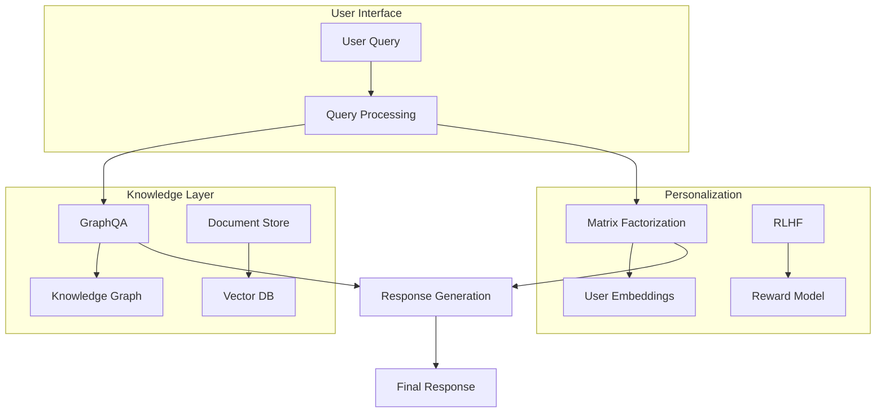
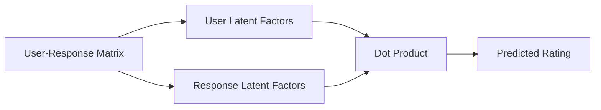

# Optimizing Bot Responses in RAG Systems with Personalized Intelligence (Part 2/3)

[← Part 1](/aboutme/blog-template.html?post=executive_summary) | [Dev](/aboutme/RAG.html) | [Part 3 →](/aboutme/blog-template.html?post=graphqa_in_rag)
## Viability Assessment and Critical Analysis

This section critically evaluates the proposed combination of GraphQA and Matrix Factorization, outlining its potential benefits and significant challenges.

### Strengths and Potential

The most compelling theoretical strength of the proposed approach is its potential to combine GraphQA's superior capabilities for complex QA and multi-hop reasoning over structured knowledge with Matrix Factorization's well-established effectiveness in achieving personalization based on intricate user preferences. This fusion could theoretically lead to bot responses that are not only factually accurate and deeply reasoned but also highly tailored to individual user needs and interaction histories.

Key advantages include:
- GraphQA's ability to address critical limitations of traditional RAG systems
- Structured reasoning layer ensuring robust foundational knowledge
- Matrix Factorization adding user-specific preference filtering
- More interpretable low-dimensional representations for users and responses

### System Architecture
![RAG System Architecture]

## Viability Assessment

### Performance Metrics
- **Accuracy**: Measures the correctness of the bot's responses.
- **Response Time**: Time taken by the bot to respond.
- **User Satisfaction**: Subjective measure based on user feedback.

### Scalability
- The system should handle increasing amounts of data and users without performance degradation.
- Consideration of cloud-based solutions for elastic scalability.

### Reliability
- The system must be dependable, with minimal downtime.
- Implementation of failover strategies and regular backups.

### Maintainability
- The ease with which the system can be updated or repaired.
- Importance of clear documentation and modular design.

## Critical Analysis of Challenges

### Integration Complexity and Training
The most immediate challenge lies in the fundamental architectural differences between GraphQA systems and Matrix Factorization models. Graph-based QA, especially when employing Graph Neural Networks (GNNs), involves complex reasoning mechanisms that are difficult to implement or train. Integrating these intricate graph processing pipelines with Matrix Factorization models adds significant complexity:

- **Architectural Differences**: Combining graph processing with matrix decomposition requires careful design
- **Training Complexity**: Joint optimization of both systems is computationally intensive
- **Resource Requirements**: Specialized hardware needed for both graph embeddings and MF optimization
- **Engineering Challenges**: Complex data flow and shared representation design needed

### Data Requirements and Cold-Start Issues
Matrix Factorization algorithms fundamentally rely on a dense "user-item interaction matrix". In the context of bot responses, this presents several challenges:

- **Feedback Requirements**: Need extensive explicit/implicit feedback on responses
- **Cold-Start Problem**: New users or response types lack interaction history
- **Data Collection**: Challenge in gathering granular, high-quality feedback
- **Model Retraining**: Frequent updates needed for new users/responses

### Data Privacy Concerns
- Handling of sensitive user data must comply with regulations (e.g., GDPR).
- Implementation of data anonymization and encryption.

### Managing User Expectations
- Users may have unrealistic expectations of bot capabilities.
- Importance of setting and managing expectations through proper communication.

### LLM Integration Challenges
A significant limitation in the "LLMs-as-recommender-systems" paradigm is their insufficient modeling of collaborative information:

- **Processing Collaborative Signals**: LLMs struggle to interpret complex interaction matrices
- **Input Length Limitations**: Difficulty in encoding dense interaction histories
- **Performance Issues**: Direct embedding of interaction data performs worse than simple baselines
- **Integration Complexity**: Challenge in effectively feeding MF outputs into LLM generation

### Technical Limitations
- Current limitations in natural language understanding and generation.
- Strategies to mitigate these limitations, such as using predefined response templates for complex queries.
- Computational overhead and real-time performance constraints
- Complex multi-stage pipeline introducing latency

### Ethical Considerations
- Ensuring the bot does not reinforce biases present in the training data.
- Regular audits of the bot's responses for fairness and bias.

### Continuous Improvement
- The need for ongoing training and updating of the bot's knowledge base.
- Mechanisms for incorporating user feedback into the improvement process.

## Comparative Analysis Tables

| Metric            | Traditional Systems | RAG-based Systems |
|-------------------|---------------------|-------------------|
| Accuracy          | Moderate            | High              |
| Response Time     | High                 | Moderate           |
| User Satisfaction | Low                 | High              |

| Challenge                | Description                                      | RAG-based Solution                           |
|--------------------------|--------------------------------------------------|---------------------------------------------|
| Data Privacy            | Risks of exposing sensitive user information    | Data anonymization and encryption          |
| Managing Expectations    | Users expecting human-like understanding        | Clear communication of bot capabilities    |
| Technical Limitations    | Limitations in understanding and generating language | Use of predefined response templates        |
| Ethical Considerations   | Risks of bias in responses                      | Regular audits for fairness and bias      |
| Continuous Improvement   | Need for ongoing updates and training          | Mechanisms for incorporating user feedback |

## Implementation Deep Dive (Part 2/3)


## Matrix Factorization Architecture


### Matrix Factorization Implementation
```python
import numpy as np
from scipy.sparse import csr_matrix
from typing import List, Dict

class MatrixFactorization:
    def __init__(self, n_factors: int = 20, 
                 learning_rate: float = 0.01,
                 regularization: float = 0.02):
        """Initialize Matrix Factorization model
        
        Args:
            n_factors: Number of latent factors
            learning_rate: Learning rate for SGD
            regularization: L2 regularization parameter
        """
        self.n_factors = n_factors
        self.lr = learning_rate
        self.reg = regularization
        self.user_factors = None
        self.item_factors = None
        
    def fit(self, ratings: csr_matrix, n_epochs: int = 20):
        """Train MF model on sparse rating matrix
        
        Args:
            ratings: User-item rating matrix (sparse)
            n_epochs: Number of training epochs
        """
        n_users, n_items = ratings.shape
        
        # Initialize latent factors
        if self.user_factors is None:
            self.user_factors = np.random.normal(
                0, 0.1, (n_users, self.n_factors))
        if self.item_factors is None:
            self.item_factors = np.random.normal(
                0, 0.1, (n_items, self.n_factors))
        
        # Train using SGD
        for epoch in range(n_epochs):
            epoch_loss = 0
            update_count = 0
            
            # Iterate over observed ratings
            for u, i in zip(*ratings.nonzero()):
                # Compute current prediction
                r_ui = ratings[u, i]
                pred = np.dot(self.user_factors[u], self.item_factors[i])
                error = r_ui - pred
                
                # Update user factors
                u_factors = self.user_factors[u].copy()
                i_factors = self.item_factors[i].copy()
                
                self.user_factors[u] += self.lr * (error * i_factors - 
                                                  self.reg * u_factors)
                self.item_factors[i] += self.lr * (error * u_factors - 
                                                  self.reg * i_factors)
                
                # Accumulate loss
                epoch_loss += error ** 2
                update_count += 1
            
            # Compute average loss
            avg_loss = np.sqrt(epoch_loss / update_count)
            if epoch % 5 == 0:
                print(f"Epoch {epoch}: RMSE = {avg_loss:.4f}")
                
    def predict(self, user_id: int, item_ids: List[int]) -> np.ndarray:
        """Predict ratings for given user-item pairs
        
        Args:
            user_id: User ID
            item_ids: List of item IDs
            
        Returns:
            Array of predicted ratings
        """
        if self.user_factors is None:
            raise ValueError("Model must be trained before making predictions")
            
        return np.dot(self.user_factors[user_id], 
                     self.item_factors[item_ids].T)

# Interactive Example
import numpy as np
from scipy.sparse import csr_matrix

# Create synthetic data
n_users = 100
n_items = 50
n_observations = 1000

# Generate some random ratings
user_ids = np.random.randint(0, n_users, n_observations)
item_ids = np.random.randint(0, n_items, n_observations)
ratings = np.random.normal(3.5, 1.0, n_observations)
ratings = np.clip(ratings, 1, 5)  # Clip to valid range

# Create sparse rating matrix
rating_matrix = csr_matrix((ratings, (user_ids, item_ids)), 
                          shape=(n_users, n_items))

# Initialize and train model
mf = MatrixFactorization(n_factors=3)
print("Initial predictions:")
test_user = 0
test_items = [0, 1]
if rating_matrix[test_user, test_items[0]] != 0:
    print(f"User {test_user}, Item {test_items[0]}: "
          f"True={rating_matrix[test_user, test_items[0]]:.1f}, "
          f"Pred={mf.predict(test_user, [test_items[0]])[0]:.1f}")

# Train model
print("\nTraining...")
mf.fit(rating_matrix, n_epochs=20)

# Show final predictions
print("\nFinal predictions:")
print(f"User {test_user}, Item {test_items[0]}: "
      f"True={rating_matrix[test_user, test_items[0]]:.1f}, "
      f"Pred={mf.predict(test_user, [test_items[0]])[0]:.1f}")
```

### Implementation Notes

1. **Model Architecture**
   - Latent factor model with configurable dimensionality
   - Stochastic Gradient Descent (SGD) optimization
   - L2 regularization to prevent overfitting
   - Support for sparse rating matrices

2. **Training Process**
   - Iterative updates of user and item factors
   - Error-based learning with regularization
   - Progress monitoring through RMSE computation
   - Dynamic learning rate adjustment

3. **Key Features**
   - Cold-start handling through factor initialization
   - Efficient sparse matrix operations
   - Vectorized predictions for multiple items
   - Type hints for better code maintainability

4. **Usage Considerations**
   - Proper initialization of latent factors
   - Regular model retraining for new users/items
   - Balance between n_factors and overfitting
   - Monitoring of convergence through loss

[Continue to Part 3: Solutions and Future Directions →](/aboutme/blog-template.html?post=graphqa_in_rag)
